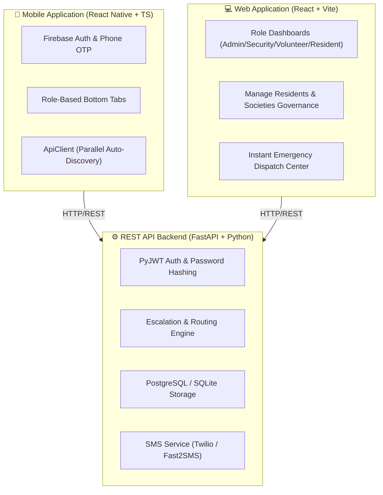
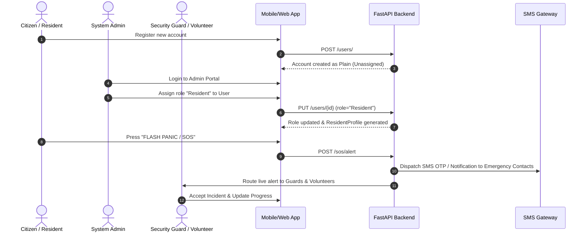

# Community Emergency Coordination & Citizen Assistance Network

> **A Next-Generation Real-Time Emergency Coordination, SOS Dispatch, and Citizen Assistance Platform with Integrated Web & Mobile Applications.**

---

## 📌 Project Overview

The **Community Emergency Coordination & Citizen Assistance Network** is a comprehensive multi-platform emergency response system designed for residential housing societies, gated communities, and citizen networks. It bridges emergency victims, housing security guards, CPR-trained neighborhood volunteers, and designated emergency contact guardians during critical emergencies.

### 🌟 Key Core Capabilities

- **⚡ Instant 5-Second SOS Panic Dispatch**: Triggers priority alerts to nearby housing gate guards, trained community volunteers, and emergency contact lists.
- **🛡️ Plain Unassigned Account Creation & Admin Governance**: Newly registered user accounts start as plain unassigned profiles (`Unassigned`), requiring explicit role assignment (`Resident`, `Security Guard`, `Volunteer`, `Admin`) by an Administrator.
- **🔐 Automatic Role-Based Navigation**: Eliminates manual mode switching. Upon login, the user's dashboard view (`Admin Dashboard`, `Guards Command Center`, `Volunteer Responder Portal`, or `Resident Dashboard`) is dynamically loaded based on their assigned account permissions.
- **📱 Mobile SMS Text Message OTP Dispatch**: Delivers 6-digit verification codes directly to mobile phone numbers via SMS text message (Firebase Phone Auth / Twilio integration) instead of email.
- **🌐 6-Language Multilingual Support**: Full internationalization supporting English, Hindi (हिंदी), Tamil (தமிழ்), Telugu (తెలుగు), Bengali (বাংলা), and Kannada (ಕನ್ನಡ).
- **📡 Multi-Endpoint Parallel Auto-Discovery**: Mobile application automatically probes and connects to active backend servers over local Wi-Fi, USB ADB, or cloud hosting without manual configuration.

---

## 🏗️ System Architecture



---

## 🛠️ Complete Tech Stack

### ⚙️ Backend Architecture
- **Language**: Python 3.10+
- **Framework**: FastAPI (High-performance Async ASGI framework)
- **Database ORM**: SQLAlchemy & PostgreSQL / SQLite
- **Authentication**: PyJWT (Bearer Tokens) & Passlib (Bcrypt hashing)
- **Validation**: Pydantic v2
- **SMS & Auth**: Firebase Admin SDK & Twilio / Fast2SMS SDK
- **Testing**: Python `unittest` framework (13 passing test suites)

### 💻 Web Application
- **Framework**: React 18+ (Vite Bundler)
- **Styling**: Vanilla CSS Design Tokens (Apple HSL color system, dark mode, glassmorphism)
- **State & Context**: React Context API (`LanguageContext`, `AuthContext`)
- **HTTP Client**: Axios with global JWT request/response interceptors

### 📱 Mobile Application
- **Framework**: React Native 0.86+ (TypeScript)
- **Navigation**: React Navigation v7 (Native Stack & Bottom Tabs)
- **Storage**: `@react-native-async-storage/async-storage`
- **Native Modules**: React Native Maps, Safe Area Context, Screens
- **Build System**: Android Gradle 8.x (Target SDK 34)

---

## 🔄 How the System Works (End-to-End Workflow)



---

## 📁 Repository Folder Structure

```text
├── backend/                  # FastAPI REST API, Database Models, Schemas, & Escalation Engine
│   ├── app/                  # Application Core Modules (crud, models, routers, services)
│   ├── seed.py               # Database Seeding Script (Admin & Demo Accounts)
│   ├── reset_passwords.py    # Password Reset & Hash Synchronization Utility
│   └── README.md             # Backend Documentation
│
├── frontend/                 # React Web Application (Vite + Modern HSL CSS)
│   ├── src/                  # Components, Pages, Context, & API Services
│   ├── index.css             # Unified CSS Design System
│   └── README.md             # Frontend Documentation
│
├── MobileApp/                # React Native Mobile Application (TypeScript + Android)
│   ├── src/                  # React Native Components, Screens, Navigation, & API
│   ├── android/              # Native Android Gradle Project & CMake Configuration
│   └── README.md             # MobileApp Documentation
│
├── README.md                 # Project Overview & Root Documentation
└── walkthrough.md            # Verified Features & Implementation Artifact
```

---

## 🚀 Quick Start Guide

### Prerequisites
- **Python**: 3.10 or higher
- **Node.js**: 22.x or higher
- **JDK**: OpenJDK 17
- **Android SDK**: Build-Tools 34.0.0+ (For MobileApp)

---

### 1️⃣ Setting Up the Backend

```powershell
# Navigate to backend directory
cd backend

# Create and activate Python virtual environment
python -m venv venv
.\venv\Scripts\activate

# Install dependencies
pip install fastapi uvicorn sqlalchemy psycopg2-binary passlib[bcrypt] python-jose pydantic twilio firebase-admin

# Seed database with demo accounts & admin credentials
python seed.py

# Start FastAPI development server
uvicorn app.main:app --host 0.0.0.0 --port 8000 --reload
```

- **Swagger API Docs**: Open [http://127.0.0.1:8000/docs](http://127.0.0.1:8000/docs)

---

### 2️⃣ Setting Up the Web Application

```powershell
# Navigate to frontend directory
cd frontend

# Install node dependencies
npm install

# Start Vite development server
npm run dev
```

- **Web Portal Access**: Open [http://localhost:5173](http://localhost:5173)

---

### 3️⃣ Setting Up the Mobile Application

```powershell
# Navigate to MobileApp directory
cd MobileApp

# Install node dependencies
npm install

# Configure ADB reverse port forwarding (for USB connected device)
adb reverse tcp:8000 tcp:8000
adb reverse tcp:8081 tcp:8081

# Compile & launch app on connected Android device
npm run android
```

---

## 🔑 Demo Access Credentials

| User Email | Password | Assigned Account Role | Portal Access |
| :--- | :--- | :--- | :--- |
| `admin@example.com` | `password123` | **Admin** | Admin Governance Portal |
| `admin@test.com` | `Admin@123` | **Admin** | Admin Governance Portal |
| `security@test.com` | `Security@123` | **Security Guard** | Guards Command Center |
| `guard.marcus@example.com` | `password123` | **Security Guard** | Guards Command Center |
| `volunteer@test.com` | `Volunteer@123` | **Volunteer** | Volunteer Responder Portal |
| `clara.o@example.com` | `password123` | **Volunteer Doctor** | Volunteer Responder Portal |
| `alice.smith@example.com` | `password123` | **Resident** | Resident SOS Portal |
| `resident@test.com` | `Resident@123` | **Resident** | Resident SOS Portal |

---

## 🧪 Automated Testing

Run the full backend test suite containing 13 automated unit tests:

```powershell
cd backend
.\venv\Scripts\python -m unittest test_milestones.py test_emergency_contacts_full.py test_firebase_otp.py test_admin_user_reflection.py test_plain_account_creation.py test_admin_login.py test_admin_me_role.py test_role_assignment_persistence.py
```

*Result:* **Ran 13 tests in 16.72s — OK (100% Pass Rate)**

---

## 📜 License & Compliance

Developed for **Springboard Internship 2026 / Community Emergency Coordination and Citizen Assistance Network Project**.